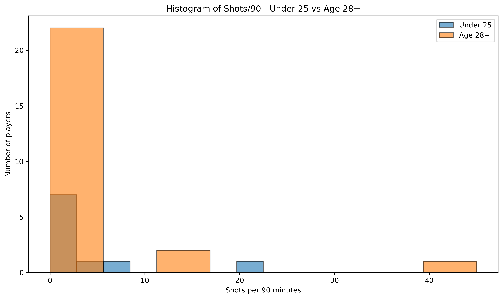
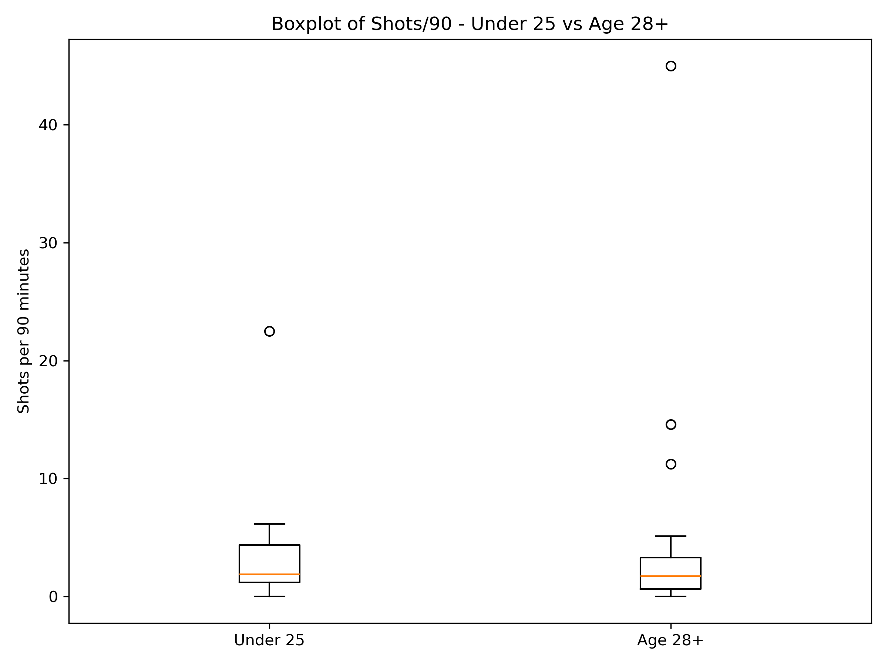
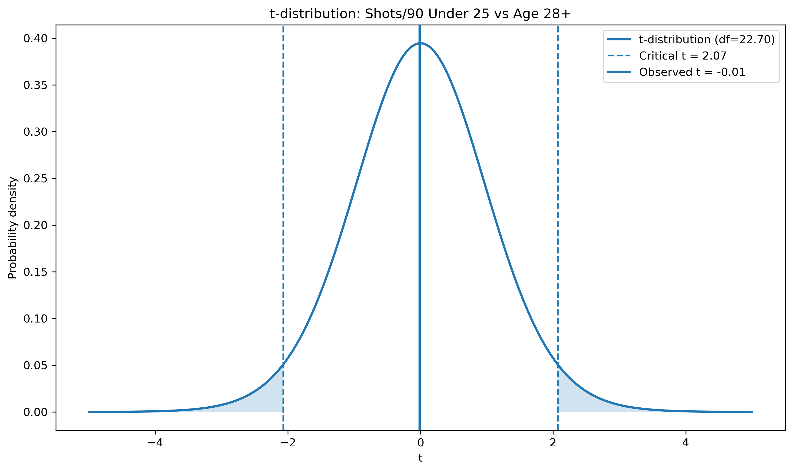

<!--
==============================================================================
HIT140 Assessment 2 - Question 1
Student Name : Hemanta Adhikari
Student ID   : s403355

Topic        : Shots/90 Analysis - Attacking Players
               Under 25 vs. Age 28+
               World Cup 2026 Attacking Shooting Analysis

Data Source  : FBref 2026 World Cup Player Shooting Statistics
Data Source Link  : https://fbref.com/en/comps/1/shooting/World-Cup-Stats
==============================================================================
-->

# Question 1 Results

## Analytical Question

> Is there a statistically significant difference in Shots/90 between attacking players under 25 and attacking players aged 28+?

## Dataset

The analysis uses FIFA World Cup 2026 player shooting statistics obtained from FBref.

- Raw dataset: `data/raw/task1/raw1.csv`
- Original records: **1039**
- Records removed during cleaning: **0**
- Attacking players identified: **275**

## 1. Data Wrangling

The raw FBref CSV was cleaned before analysis. The actual FBref table header was identified, invalid Age and Sh/90 values were removed, and the Squad field was cleaned.

An attacking player was operationally defined as a player whose FBref position contains `FW`. This includes `FW`, `FWMF` and `MFFW` positions.

- Original records: **1039**
- Records removed during cleaning: **0**
- Attacking players: **275**
- Under 25 available: **69**
- Age 28+ available: **123**

## 2. Data Preparation and Sampling

- Under 25 group: `Age < 25`
- Age 28+ group: `Age >= 28`
- Players aged 25, 26 and 27 were excluded.
- Sampling method: Random sampling.
- Fixed random seed: **137**
- Final sample size: **35**
- Under 25 sample: **10**
- Age 28+ sample: **25**

The processed dataset is saved as `data/processed/processed1.csv`.

## 3. Descriptive Statistics

| Statistic | Under 25 | Age 28+ |
|---|---:|---:|
| Sample size | 10 | 25 |
| Mean | 4.268 | 4.307 |
| Median | 1.880 | 1.740 |
| Minimum | 0.000 | 0.000 |
| Maximum | 22.500 | 45.000 |
| Range | 22.500 | 45.000 |
| Variance | 44.882 | 83.698 |
| Standard deviation | 6.699 | 9.149 |
| Q1 | 1.205 | 0.620 |
| Q3 | 4.355 | 3.310 |
| IQR | 3.150 | 2.690 |

## 4. 95% Confidence Interval

| Age Group | Mean | Standard Deviation | n | 95% Confidence Interval |
|---|---:|---:|---:|---|
| Under 25 | 4.268 | 6.699 | 10 | -0.524 to 9.060 |
| Age 28+ | 4.307 | 9.149 | 25 | 0.531 to 8.084 |

## 5. Welch Two-Sample t-Test

### Null Hypothesis (H0)

There is no difference in mean Shots/90 between attacking players under 25 and attacking players aged 28+.

### Alternative Hypothesis (H1)

There is a difference in mean Shots/90 between attacking players under 25 and attacking players aged 28+.

- Significance level: **α = 0.05**
- t-statistic: **-0.014**
- Degrees of freedom: **22.698**
- p-value: **0.9889**
- Decision: **Fail to reject H0**

## 6. Conclusion

There is not enough statistical evidence to conclude that the mean Shots/90 differs between attacking players under 25 and attacking players aged 28+.

The mean Shots/90 for Under 25 players was **4.268**, while the mean for Age 28+ players was **4.307**.

The difference between the sample means was **-0.039 Shots/90**.

Because the p-value is greater than 0.05, the null hypothesis is not rejected. This does not prove that the population means are exactly equal. It means that the sample does not provide sufficient evidence of a statistically significant difference.

## 7. Visualisations

### Histogram



### Boxplot



### t-Distribution



## 8. Output Files

- Raw dataset: `data/raw/raw1.csv`
- Processed dataset: `data/processed/processed1.csv`
- Analysis script: `scripts/task1.py`
- Confidence interval function: `src/Utility.py`
- Histogram: `figures/task1/histogram.png`
- Boxplot: `figures/task1/boxplot.png`
- t-Distribution: `figures/task1/t_distribution.png`

## 9. How to Run

From the project root, run the script directly:

```bash
python scripts/task1.py
```

Or from inside the `scripts/` folder:

```bash
cd scripts
python task1.py
```

## 10. Data Source

FBref.com (Sports Reference), FIFA World Cup Standard Shooting statistics.

https://fbref.com/en/
